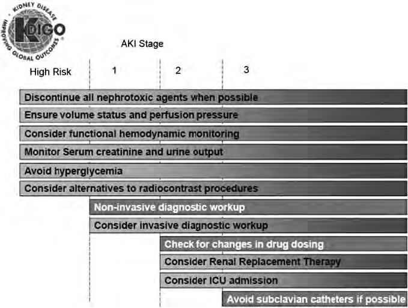

## Questions

In a 53-year-old male with acute kidney injury (AKI) onset 4 hours after ICU admission, significant comorbidities including congestive heart failure, diabetes with complications, severe liver disease, moderate/severe renal disease, and current medications comprising a nephrotoxic agent, antibiotic, and anticoagulant, what are the evidence-based treatment options considering his tachycardia, elevated respiratory rate, fever, and fluid overload?

**Run configuration**

- **Vectors:** `data/real_vectors.jsonl` | topk=5, rerank=False, topn=5
- **Vision:** 1 figure(s) as `image_url` (pixels), max=6 | VISION_MAX_EDGE=1536

---

## Summary

**Patient / treatment context** — verbatim from the case file (used to build the retrieval query in **Questions**):

```
CASE ID: CASE_07
STAY ID: 33570939
============================================================
PATIENT CLINICAL PROFILE:

PATIENT DEMOGRAPHICS:
  Age: 53 | Sex: Male | Race: WHITE
  Insurance: Private | Admission type: OBSERVATION ADMIT

AKI ONSET:
  Baseline creatinine: 1.30 mg/dL
  Hours from ICU admission to AKI onset: 4.0h

CREATININE (ICU window, intime → onset), n=1 creatinine measurements in this window:
  First     : 2.10 mg/dL
  Min       : 2.10 mg/dL
  Max       : 2.10 mg/dL
  At onset  : 2.10 mg/dL
  Delta      : +0.80 mg/dL
  Ratio      : 1.61x baseline
  Slope      : N/A

LAB VALUES (last value before onset):
  BUN            : last=30.0 mg/dL  [min=30.0, max=30.0]  (n=1)
  POTASSIUM      : last=4.0 mEq/L  [min=4.0, max=4.0]  (n=1)
  BICARBONATE    : last=15.0 mEq/L  [min=15.0, max=15.0]  (n=1)
  HEMOGLOBIN     : last=9.5 g/dL  [min=9.5, max=9.5]  (n=1)

VITAL SIGNS (ICU window):
  MAP   : mean=98.2 mmHg  [min=89.0, max=107.0]  last=94.0  last6h=98.2  (n=5)
  HR    : mean=110.5 bpm  [min=97.0, max=124.0]  last=97.0  last6h=110.5  (n=6) ⚠ TACHYCARDIA
  SPO2  : mean=96.1 %  [min=94.0, max=98.0]  last=98.0  last6h=96.1  (n=7)
  RR    : mean=23.2 /min  [min=14.0, max=30.0]  last=14.0  last6h=23.2  (n=6) ⚠ ELEVATED
  TEMP  : mean=38.4 °C  [min=38.1, max=38.9]  last=38.3  last6h=38.4  (n=3) ⚠ FEVER

URINE OUTPUT, n=1 urine-output entries:
  Total UO   : 225 mL
  Rate       : 56.2 mL/h
  Last 6h    : 225 mL
  Last 12h   : 225 mL
  Last 24h   : 225 mL

FLUID BALANCE:
  Total input  : 905 mL
  Net balance  : +680 mL

COMORBIDITIES (Charlson score: 13):
  + Congestive heart failure
  + Dementia
  + Mild liver disease
  + Diabetes (mild)
  + Diabetes (severe/complications)
  + Moderate/severe renal disease
  + Malignancy
  + Severe liver disease
  Additional flags: Hypertension, Diabetes, Chronic kidney disease, Sepsis, Liver disease, Malignancy, Coagulopathy

PRIOR MEDICATIONS (before current admission):
  ACEI/ARB, Vancomycin, Statin

CURRENT MEDICATIONS (active at AKI onset):
  Nephrotoxic agent, Antibiotic, Anticoagulant

OTHER:
  BMI            : 34.0
  Smoking status : not recorded
```

---

### Answer (generated by LLM based on literature)

In managing a 53-year-old male with acute kidney injury (AKI) characterized by fluid overload, tachycardia, elevated respiratory rate, and fever, alongside significant comorbidities including congestive heart failure, diabetes, severe liver disease, and moderate/severe renal disease, it is critical to anchor interventions to key clinical measures. The patient's AKI onset, combined with nephrotoxic medication use, necessitates strategic treatment to stabilize and address his renal dysfunction.

1. **Discontinue Nephrotoxic Agents:**
   - **Why this patient:** The presence of AKI accompanied by multiple comorbidities and current nephrotoxic medication suggests an urgent need to discontinue such agents to prevent further kidney damage. This aligns with guidelines recommending cessation of nephrotoxins in the setting of AKI [KDOQI US commentary (pmid_23499048_p12), KDOQI US commentary (pmid_23499048_p10)].
   - **When to use / contraindications:** All efforts should be made to stop nephrotoxic drugs unless absolutely necessary; explore alternatives when available.
   - **Supporting sources:** [KDOQI US commentary (pmid_23499048_p12)], [KDOQI US commentary (pmid_23499048_p10)]

2. **Manage Fluid Overload with Controlled Diuretic Use:**
   - **Why this patient:** Given the patient's fluid overload and severe comorbidities, judicious use of diuretics can help manage volume status. AKI guidelines suggest diuretics only for fluid management, not as a primary treatment for AKI per se [KDOQI US commentary (pmid_23499048_p12), KDOQI US commentary (pmid_23499048_p8)].
   - **When to use / contraindications:** Caution is required due to the patient’s heart failure and renal issues. Monitor electrolyte levels closely.
   - **Supporting sources:** [KDOQI US commentary (pmid_23499048_p12)], [KDOQI US commentary (pmid_23499048_p8)]

3. **Renal Replacement Therapy (RRT) Consideration:**
   - **Why this patient:** If fluid management strategies are insufficient and renal function continues to decline, RRT may be necessary, particularly in severe metabolic disturbance or refractory fluid overload, taking the patient's respiratory rate and perfusion status into account [KDOQI US commentary (pmid_23499048_p12)]. 
   - **When to use / contraindications:** Initiate if there is worsening AKI or symptoms unresponsive to medical management. Consider patient’s hemodynamic stability.
   - **Supporting sources:** [KDOQI US commentary (pmid_23499048_p12)], [KDOQI US commentary (pmid_23499048_p3)]

Given the complexity of the patient's condition, ongoing evaluation and consultation with a nephrology specialist are advised to tailor interventions accurately. The patient’s elevated respiratory rate and signs of fluid overload make timely intervention critical to avoid worsening his AKI and other underlying conditions. 

### References

- KDOQI US commentary on the 2012 KDIGO clinical practice guideline for acute kidney injury (pmid_23499048_p12). Supported nephrotoxic agent discontinuation and fluid management.
- KDOQI US commentary on the 2012 KDIGO clinical practice guideline for acute kidney injury (pmid_23499048_p10). Highlighted importance of avoiding nephrotoxins.
- KDOQI US commentary on the 2012 KDIGO clinical practice guideline for acute kidney injury (pmid_23499048_p8). Discussed fluid management options and contraindications.

---

## Used Sources (with context)

### Retrieval hits

| rank | score | chunk_id | doc_id | parent_block_id |
|------|-------|----------|--------|-----------------|
| 1 | 0.7932 | `pmid_23499048_p12_t0_c0` | `pmid_23499048` | `pmid_23499048_p12` |
| 2 | 0.7389 | `pmid_23499048_p8_t1_c0` | `pmid_23499048` | `pmid_23499048_p8` |
| 3 | 0.7338 | `pmid_23499048_p8_t1_c1` | `pmid_23499048` | `pmid_23499048_p8` |
| 4 | 0.7084 | `pmid_23499048_p3_t1_c0` | `pmid_23499048` | `pmid_23499048_p3` |
| 5 | 0.6504 | `pmid_23499048_p10_t0_c0` | `pmid_23499048` | `pmid_23499048_p10` |

<sub>**Score**: cosine similarity between query and chunk embedding (BGE `bge-base-en-v1.5`, L2-normalized → dot product). Range ≈ [-1, 1]; higher = more relevant. Rule of thumb for BGE: &gt;0.7 strong, 0.5–0.7 moderate, &lt;0.5 weak.</sub>

### === DOC pmid_23499048 / KDOQI US commentary on the 2012 KDIGO clinical practice guideline for acute kidney injury. / pmid_23499048_p10 ===

**`pmid_23499048_p10_t0_c0`** *(text)*

In all, there were only 11 (18%) recommendations in this guideline for which the overall quality of evidence was graded ‘A,’ whereas 20 (32.8%) were graded ‘B,’ 23 (37.7%) were graded ‘C,’ and 7 (11.5%) were graded ‘D.’ Although there are reasons other than quality of evidence to make a grade 1 or 2 recommendation, in general, there is a correlation between the quality of overall evidence and the strength of the recommendation. Thus, there were 22 (36.1%) recommendations graded ‘1’ and 39 (63.9%) graded ‘2.’ There were 9 (14.8%) recommendations graded ‘1A,’ 10 (16.4%) were ‘1B,’ 3 (4.9%) were ‘1C,’ and 0 (0%) were ‘1D.’ There were 2 (3.3%) graded ‘2A,’ 10 (16.4%) were ‘2B,’ 20 (32.8%) were ‘2C,’ and 7 (11.5%) were ‘2D.’ There were 26 (29.9%) statements that were not graded. Some argue that recommendations should not be made when evidence is weak.

### === DOC pmid_23499048 / KDOQI US commentary on the 2012 KDIGO clinical practice guideline for acute kidney injury. / pmid_23499048_p12 ===

**`pmid_23499048_p12_fig_0_c0`** *(image)*



**OCR text**

```
AKIStage HighRisk 2 3 Discontinue all nephrotoxic agents when possible Ensurevolumestatus and perfusionpressure Consider functional hemodynamicmonitoring Monitor Serum creatinine and urine output Avoid hyperglycemia Consideralternativestoradiocontrastprocedures Non-invasivediagnosticworkup Considerinvasive diagnosticworkup Checkforchanges in drug dosing Consider Renal Replacement Therapy ConsiderICuadmission Avoid subclavian catheters ifpossible
```

**`pmid_23499048_p12_t0_c0`** *(text)*

3.1.3: We suggest using protocol-based management of hemodynamic and oxygenation parameters to prevent development or worsening of AKI in high-risk patients in the perioperative setting (2C) or in patients with septic shock (2C). 3.3.1: In critically ill patients, we suggest insulin therapy targeting plasma glucose 110–149 mg/dl (6.1–8.3mmol/l). (2C) 3.3.2: We suggest achieving a total energy intake of 20–30 kcal/kg/d in patients with any stage of AKI. (2C) 3.3.3: We suggest to avoid restriction of protein intake with the aim of preventing or delaying initiation of RRT. (2D) 3.3.4: We suggest administering 0.8–1.0 g/kg/d of protein in noncatabolic AKI patients without need for dialysis (2D), 1.0–1.5 g/kg/d in patients with AKI on RRT (2D), and up to a maximum of 1.7 g/kg/d in patients on continuous renal replacement therapy (CRRT) and in hypercatabolic patients. (2D) 3.3.5: We suggest providing nutrition preferentially via the enteral route in patients with AKI. (2C) 3.4.1: We recommend not using diuretics to prevent AKI. (1B) 3.4.2: We suggest not using diuretics to treat AKI, except in the management of volume overload. (2C) 3.5.1: We recommend not using low-dose dopamine to prevent or treat AKI.

**`pmid_23499048_p12_t1_c0`** *(text)*

1: We suggest that a single dose of theophylline may be given in neonates with severe perinatal asphyxia, who are at high risk of AKI. (2B) 3.8.1: We suggest not using aminoglycosides for the treatment of infections unless no suitable, less nephrotoxic, therapeutic alternatives are available. (2A) 3.8.2: We suggest that, in patients with normal kidney function in steady state, aminoglycosides are administered as a single dose daily rather than multiple-dose daily treatment regimens. (2B) 3.8.3: We recommend monitoring aminoglycoside drug levels when treatment with multiple daily dosing is used for more than 24 hours. (1A) 3.8.4: We suggest monitoring aminoglycoside drug levels when treatment with single-daily dosing is used for more than 48 hours. (2C) 3.8.5: We suggest using topical or local applications of aminoglycosides (e.g., respiratory aerosols, instilled antibiotic beads), rather than i.v. application, when feasible and suitable. (2B) 3.8.6: We suggest using lipid formulations of amphotericin B rather than conventional formulations of amphotericin B. (2A) 3.8.7: In the treatment of systemic mycoses or parasitic infections, we recommend using azole antifungal agents and/or the echinocandins rather than conventional amphotericin B, if equal therapeutic efficacy can be assumed.

**`pmid_23499048_p12_t0_c1`** *(text)*

(2D) 3.3.5: We suggest providing nutrition preferentially via the enteral route in patients with AKI. (2C) 3.4.1: We recommend not using diuretics to prevent AKI. (1B) 3.4.2: We suggest not using diuretics to treat AKI, except in the management of volume overload. (2C) 3.5.1: We recommend not using low-dose dopamine to prevent or treat AKI. (1A) 3.5.2: We suggest not using fenoldopam to prevent or treat AKI. (2C) 3.5.3: We suggest not using atrial natriuretic peptide (ANP) to prevent (2C) or treat (2B) AKI. 3.6.1: We recommend not using recombinant human (rh)IGF-1 to prevent or treat AKI. (1B) 3.7.

**`pmid_23499048_p12_t1_c1`** *(text)*

(2B) 3.8.6: We suggest using lipid formulations of amphotericin B rather than conventional formulations of amphotericin B. (2A) 3.8.7: In the treatment of systemic mycoses or parasitic infections, we recommend using azole antifungal agents and/or the echinocandins rather than conventional amphotericin B, if equal therapeutic efficacy can be assumed. (1A) Figure 4 | Stage-based management of AKI. Shading of boxes indicates priority of action—solid shading indicates actions that are equally appropriate at all stages whereas graded shading indicates increasing priority as intensity increases. AKI, acute kidney injury; ICU, intensive- care unit.

**`pmid_23499048_p12_t0_c2`** *(text)*

(2C) 3.5.1: We recommend not using low-dose dopamine to prevent or treat AKI. (1A) 3.5.2: We suggest not using fenoldopam to prevent or treat AKI. (2C) 3.5.3: We suggest not using atrial natriuretic peptide (ANP) to prevent (2C) or treat (2B) AKI. 3.6.1: We recommend not using recombinant human (rh)IGF-1 to prevent or treat AKI. (1B) 3.7.

**`pmid_23499048_p12_t1_c2`** *(text)*

(1A) Figure 4 | Stage-based management of AKI. Shading of boxes indicates priority of action—solid shading indicates actions that are equally appropriate at all stages whereas graded shading indicates increasing priority as intensity increases. AKI, acute kidney injury; ICU, intensive- care unit.

### === DOC pmid_23499048 / KDOQI US commentary on the 2012 KDIGO clinical practice guideline for acute kidney injury. / pmid_23499048_p3 ===

**`pmid_23499048_p3_t1_c0`** *(text)*

NAC for risk of CI-AKI 85 Figure 17. Flow-chart summary of recommendations 96 Additional information in the form of supplementary materials can be found online at http://www.kdigo.org/clinical_practice_guidelines/AKI.php contents http://www.kidney-international.

### === DOC pmid_23499048 / KDOQI US commentary on the 2012 KDIGO clinical practice guideline for acute kidney injury. / pmid_23499048_p8 ===

**`pmid_23499048_p8_t1_c0`** *(text)*

Intraarterial ICU Intensive-care unit IGF-1 Insulin-like growth factor-1 IHD Intermittent hemodialysis IIT Intensive insulin therapy i.v. Intravenous KDIGO Kidney Disease: Improving Global Outcomes KDOQI Kidney Disease Outcomes Quality Initiative LOS Length of stay MDRD Modification of Diet in Renal Disease MI Myocardial infarction MIC Minimum inhibitory concentration MRI Magnetic resonance imaging MW Molecular weight NAC N-acetylcysteine NICE-SUGAR Normoglycemia in Intensive Care Evaluation and Survival Using Glucose Algorithm Regulation NKD No known kidney disease NKF National Kidney Foundation NSF Nephrogenic Systemic Fibrosis OR Odds ratio PD Peritoneal dialysis PICARD Program to Improve Care in Acute Renal Disease RCT Randomized controlled trial RIFLE Risk, Injury, Failure; Loss, End-Stage Renal Disease RR Relative risk RRT Renal replacement therapy SAFE Saline vs. Albumin Fluid Evaluation SCr Serum creatinine ScvO2 Central venous oxygen saturation SLED Sustained low-efficiency dialysis TCC Tunneled cuffed catheter VISEP Efficacy of Volume Substitution and Insulin Therapy in Severe Sepsis http://www.kidney-international.

**`pmid_23499048_p8_t1_c1`** *(text)*

Intravenous KDIGO Kidney Disease: Improving Global Outcomes KDOQI Kidney Disease Outcomes Quality Initiative LOS Length of stay MDRD Modification of Diet in Renal Disease MI Myocardial infarction MIC Minimum inhibitory concentration MRI Magnetic resonance imaging MW Molecular weight NAC N-acetylcysteine NICE-SUGAR Normoglycemia in Intensive Care Evaluation and Survival Using Glucose Algorithm Regulation NKD No known kidney disease NKF National Kidney Foundation NSF Nephrogenic Systemic Fibrosis OR Odds ratio PD Peritoneal dialysis PICARD Program to Improve Care in Acute Renal Disease RCT Randomized controlled trial RIFLE Risk, Injury, Failure; Loss, End-Stage Renal Disease RR Relative risk RRT Renal replacement therapy SAFE Saline vs. Albumin Fluid Evaluation SCr Serum creatinine ScvO2 Central venous oxygen saturation SLED Sustained low-efficiency dialysis TCC Tunneled cuffed catheter VISEP Efficacy of Volume Substitution and Insulin Therapy in Severe Sepsis http://www.kidney-international.

