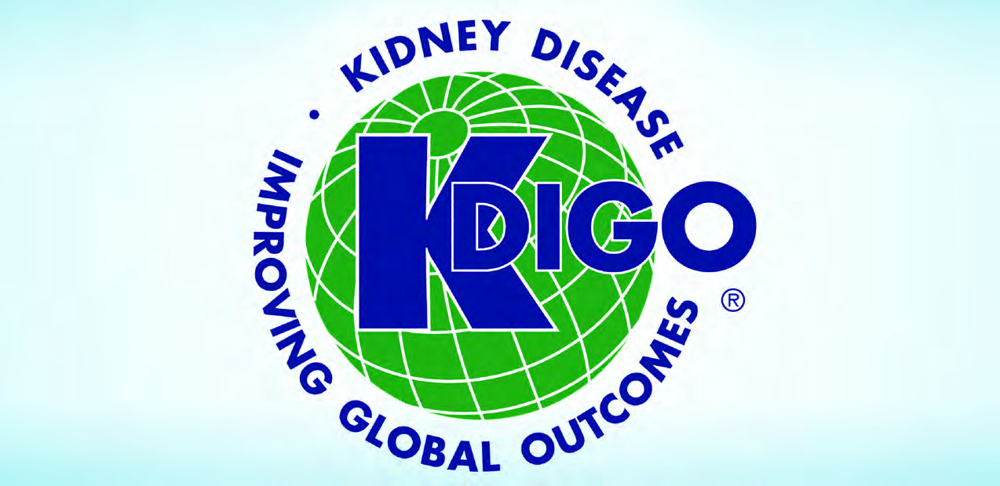
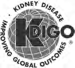

# Question

What are the evidence-based treatment options for acute kidney injury in a 59-year-old female with severe liver disease, complicated diabetes, malignancy, and coagulopathy, considering potential drug interactions with anticoagulants and previous use of diuretics and vancomycin, with current elevated BUN and hemoglobin levels?

**Vectors:** `data/real_vectors.jsonl` | topk=5, rerank=False, topn=5

**Vision:** 6 figure(s) sent as `image_url` (pixels). max=6 | VISION_MAX_EDGE=1536

---

## Answer

### Summary of Evidence-Based Treatment Options for Acute Kidney Injury

A 59-year-old female with severe liver disease, complicated diabetes, malignancy, and coagulopathy presents a complex case of acute kidney injury (AKI). Treatment for AKI must consider her current medication use, especially anticoagulants and previous diuretic and vancomycin use, along with elevated blood urea nitrogen (BUN) and hemoglobin levels. Ensuring effective management while mitigating potential drug interactions and adverse effects is critical.

### Treatment Options

1. **Renal Replacement Therapy (RRT)**
   - **Appropriate For**: Patients with severe AKI and complications such as electrolyte imbalance, fluid overload, or uremia not responsive to medical management.
   - **Contraindications**: Coagulopathy may present a risk for bleeding during hemodialysis; thus, anticoagulation regimen adjustments might be needed.
   - **Supporting Evidence**: Continuous RRT modalities may be preferable due to the patient’s critical illness status and multiorgan dysfunction, which can be better tolerated than intermittent hemodialysis [Prospective randomized trial to assess caloric and protein needs (pmid_23499048_p1)].

2. **Supportive Care and Monitoring**
   - **Appropriate For**: All patients with AKI should receive close monitoring of fluid balance, electrolytes, and hemodynamic status.
   - **Contraindications**: Careful management to avoid fluid overload, especially given the history of severe liver disease.
   - **Supporting Evidence**: General supportive care remains foundational, as ongoing assessment can guide the need for interventions like diuretics or RRT [KDOQI US commentary on the 2012 KDIGO clinical practice guideline (pmid_23499048_p2)].

3. **Diuretics (Furosemide)**
   - **Appropriate For**: Considered in managing fluid overload in AKI, provided there is some urine output.
   - **Contraindications**: Use cautiously due to potential worsening of AKI or underlying conditions like hepatic dysfunction; careful monitoring is advised due to the history of diuretic use and potential furosemide adverse effects [Diuretics in acute kidney injury (pmid_23499048_p130)].
   - **Supporting Evidence**: The use of high doses of furosemide does not improve outcomes significantly and should be employed judiciously [Effect of furosemide vs. control on need for RRT (pmid_23499048_p3)].

### Conclusion

Given the patient’s complex medical background, RRT may be the most appropriate initial intervention if medical management fails or complications from AKI become severe. Supportive care should be provided alongside any therapeutic intervention, emphasizing the importance of monitoring and adjusting treatment plans as the patient’s condition evolves.

### References

- Prospective randomized trial to assess caloric and protein needs (pmid_23499048_p1)
- KDOQI US commentary on the 2012 KDIGO clinical practice guideline (pmid_23499048_p2)
- Diuretics in acute kidney injury (pmid_23499048_p130)
- Effect of furosemide vs. control on need for RRT (pmid_23499048_p3)

---

## Used Sources (with context)

### === DOC pmid_23499048 / KDOQI US commentary on the 2012 KDIGO clinical practice guideline for acute kidney injury. / pmid_23499048_p1 ===

**`pmid_23499048_p1_fig_0_c0`** *(image)*



**OCR text**

```
KIDNEY DIGO R GLOBAL
```

**`pmid_23499048_p1_fig_1_c0`** *(image)*


**`pmid_23499048_p1_fig_2_c0`** *(image)*


**`pmid_23499048_p1_fig_3_c0`** *(image)*


**`pmid_23499048_p1_fig_4_c0`** *(image)*


**`pmid_23499048_p1_fig_5_c0`** *(image)*


**`pmid_23499048_p1_fig_6_c0`** *(image)*


**`pmid_23499048_p1_fig_7_c0`** *(image)*


**`pmid_23499048_p1_fig_8_c0`** *(image)*


**`pmid_23499048_p1_t0_c0`** *(text)*

VOLUME 2 | ISSUE 1 | MARCH 2012 http://www.kidney-international.org OFFICIAL JOURNAL OF THE INTERNATIONAL SOCIETY OF NEPHROLOGY KDIGO Clinical Practice Guideline for Acute Kidney Injury

### === DOC pmid_23499048 / KDOQI US commentary on the 2012 KDIGO clinical practice guideline for acute kidney injury. / pmid_23499048_p130 ===

**`pmid_23499048_p130_t0_c0`** *(text)*

160. Cianciaruso B, Bellizzi V, Napoli R, et al. Hepatic uptake and release of glucose, lactate, and amino acids in acutely uremic dogs. Metabolism 1991; 40: 261–269. 161. Druml W, Mitch WE. Metabolic abnormalities in acute renal failure. Semin Dial 1996; 9: 484–490. 162. Schneeweiss B, Graninger W, Stockenhuber F, et al. Energy metabolism in acute and chronic renal failure. Am J Clin Nutr 1990; 52: 596–601. 163. Macias WL, Alaka KJ, Murphy MH, et al. Impact of the nutritional regimen on protein catabolism and nitrogen balance in patients with acute renal failure. JPEN J Parenter Enteral Nutr 1996; 20: 56–62. 164. Fiaccadori E, Maggiore U, Rotelli C, et al. Effects of different energy intakes on nitrogen balance in patients with acute renal failure: a pilot study. Nephrol Dial Transplant 2005; 20: 1976–1980. 165. Fiaccadori E, Cremaschi E. Nutritional assessment and support in acute kidney injury. Curr Opin Crit Care 2009; 15: 474–480. 166. Powell-Tuck J. Nutritional interventions in critical illness. Proc Nutr Soc 2007; 66: 16–24. 167. Scheinkestel CD, Adams F, Mahony L, et al. Impact of increasing parenteral protein loads on amino acid levels and balance in critically ill anuric patients on continuous renal replacement therapy.

**`pmid_23499048_p130_t1_c0`** *(text)*

Chima CS, Meyer L, Hummell AC, et al. Protein catabolic rate in patients with acute renal failure on continuous arteriovenous hemofiltration and total parenteral nutrition. J Am Soc Nephrol 1993; 3: 1516–1521. 171. Leblanc M, Garred LJ, Cardinal J, et al. Catabolism in critical illness: estimation from urea nitrogen appearance and creatinine production during continuous renal replacement therapy. Am J Kidney Dis 1998; 32: 444–453. 172. Marshall MR, Golper TA, Shaver MJ, et al. Urea kinetics during sustained low-efficiency dialysis in critically ill patients requiring renal replacement therapy. Am J Kidney Dis 2002; 39: 556–570. 173. Salahudeen AK, Kumar V, Madan N, et al. Sustained low efficiency dialysis in the continuous mode (C-SLED): dialysis efficacy, clinical outcomes, and survival predictors in critically ill cancer patients. Clin J Am Soc Nephrol 2009; 4: 1338–1346. 174. Barnert J, Dumitrascu D, Neeser G, et al. Gastric emptying of a liquid meal in intensive care unit patients (abstr). Gastroenterology 1998; 114: A865. 175. Fiaccadori E, Maggiore U, Clima B, et al. Incidence, risk factors, and prognosis of gastrointestinal hemorrhage complicating acute renal failure. Kidney Int 2001; 59: 1510–1519.

**`pmid_23499048_p130_t2_c0`** *(text)*

Prospective randomized trial to assess caloric and protein needs of critically Ill, anuric, ventilated patients requiring continuous renal replacement therapy. Nutrition 2003; 19: 909–916. 178. Fiaccadori E, Maggiore U, Giacosa R, et al. Enteral nutrition in patients with acute renal failure. Kidney Int 2004; 65: 999–1008. 179. Caldwell MD, Kennedy-Caldwell C. Normal nutritional requirements. Surg Clin North Am 1981; 61: 489–507. 180. Zappitelli M, Goldstein SL, Symons JM, et al. Protein and calorie prescription for children and young adults receiving continuous renal replacement therapy: a report from the Prospective Pediatric Continuous Renal Replacement Therapy Registry Group. Crit Care Med 2008; 36: 3239–3245. 181. Mehta RL, Pascual MT, Soroko S, et al. Diuretics, mortality, and nonrecovery of renal function in acute renal failure. JAMA 2002; 288: 2547–2553. 182. Uchino S, Doig GS, Bellomo R, et al. Diuretics and mortality in acute renal failure. Crit Care Med 2004; 32: 1669–1677. 183. Karajala V, Mansour W, Kellum JA. Diuretics in acute kidney injury. Minerva Anestesiol 2009; 75: 251–257. 184. Ponto LL, Schoenwald RD. Furosemide (frusemide). A pharmacokinetic/ pharmacodynamic review (Part II).

**`pmid_23499048_p130_t3_c0`** *(text)*

Effect of furosemide on renal blood flow in the conscious dog. Proc Soc Exp Biol Med 1970; 133: 513–515. 188. Cantarovich F, Rangoonwala B, Lorenz H, et al. High-dose furosemide for established ARF: a prospective, randomized, double-blind, placebo- controlled, multicenter trial. Am J Kidney Dis 2004; 44: 402–409. 189. Lassnigg A, Donner E, Grubhofer G, et al. Lack of renoprotective effects of dopamine and furosemide during cardiac surgery. J Am Soc Nephrol 2000; 11: 97–104. 190. Lombardi R, Ferreiro A, Servetto C. Renal function after cardiac surgery: adverse effect of furosemide. Ren Fail 2003; 25: 775–786. 191. Solomon R, Werner C, Mann D, et al. Effects of saline, mannitol, and furosemide to prevent acute decreases in renal function induced by radiocontrast agents. N Engl J Med 1994; 331: 1416–1420. 192. Ho KM, Sheridan DJ. Meta-analysis of frusemide to prevent or treat acute renal failure. BMJ 2006; 333: 420. 193. Ho KM, Power BM. Benefits and risks of furosemide in acute kidney injury. Anaesthesia 2010; 65: 283–293. 194. Hager B, Betschart M, Krapf R. Effect of postoperative intravenous loop diuretic on renal function after major surgery. Schweiz Med Wochenschr 1996; 126: 666–673.

**`pmid_23499048_p130_t4_c0`** *(text)*

Discontinuation of continuous renal replacement therapy: a post hoc analysis of a prospective multicenter observational study. Crit Care Med 2009; 37: 2576–2582. 197. Weisberg LS, Kurnik PB, Kurnik BR. Risk of radiocontrast nephropathy in patients with and without diabetes mellitus. Kidney Int 1994; 45: 259–265. 198. Schetz M. Should we use diuretics in acute renal failure? Best Pract Res Clin Anaesthesiol 2004; 18: 75–89. 199. Yallop KG, Sheppard SV, Smith DC. The effect of mannitol on renal function following cardio-pulmonary bypass in patients with normal pre-operative creatinine. Anaesthesia 2008; 63: 576–582. 200. Smith MN, Best D, Sheppard SV, et al. The effect of mannitol on renal function after cardiopulmonary bypass in patients with established renal dysfunction. Anaesthesia 2008; 63: 701–704. 201. Schnuelle P, Johannes van der Woude F. Perioperative fluid management in renal transplantation: a narrative review of the literature. Transpl Int 2006; 19: 947–959. 202. van Valenberg PL, Hoitsma AJ, Tiggeler RG, et al. Mannitol as an indispensable constituent of an intraoperative hydration protocol for the prevention of acute renal failure after renal cadaveric transplantation.

**`pmid_23499048_p130_t5_c0`** *(text)*

Management of crush-related injuries after disasters. N Engl J Med 2006; 354: 1052–1063. 206. Vanholder R, Sever MS, Erek E, et al. Rhabdomyolysis. J Am Soc Nephrol 2000; 11: 1553–1561. 207. Bellomo R, Chapman M, Finfer S, et al. Low-dose dopamine in patients with early renal dysfunction: a placebo-controlled randomised trial. Australian and New Zealand Intensive Care Society (ANZICS) Clinical Trials Group. Lancet 2000; 356: 2139–2143. 208. Murray PT. Use of dopaminergic agents for renoprotection in the ICU. Yearbook of Intensive Care and Emergency Medicine. Springer-Verlag: Berlin, Germany, 2003: 637–648. 209. Lauschke A, Teichgraber UK, Frei U, et al. ‘Low-dose’ dopamine worsens renal perfusion in patients with acute renal failure. Kidney Int 2006; 69: 1669–1674. 210. Kellum JA, M Decker J. Use of dopamine in acute renal failure: a meta- analysis. Crit Care Med 2001; 29: 1526–1531. 211. Marik PE. Low-dose dopamine: a systematic review. Intensive Care Med 2002; 28: 877–883. 212. Friedrich JO, Adhikari N, Herridge MS, et al. Meta-analysis: low-dose dopamine increases urine output but does not prevent renal dysfunction or death. Ann Intern Med 2005; 142: 510–524. 213. Murray PT. Fenoldopam: renal-dose dopamine redux?

**`pmid_23499048_p130_t6_c0`** *(text)*

Fenoldopam reduces the need for renal replacement therapy and in-hospital death in cardiovascular surgery: a meta-analysis. J Cardiothorac Vasc Anesth 2008; 22: 27–33. Kidney International Supplements (2012) 2, 124–138 127 references

**`pmid_23499048_p130_t0_c1`** *(text)*

Proc Nutr Soc 2007; 66: 16–24. 167. Scheinkestel CD, Adams F, Mahony L, et al. Impact of increasing parenteral protein loads on amino acid levels and balance in critically ill anuric patients on continuous renal replacement therapy. Nutrition 2003; 19: 733–740. 168. Bellomo R, Tan HK, Bhonagiri S, et al. High protein intake during continuous hemodiafiltration: impact on amino acids and nitrogen balance. Int J Artif Organs 2002; 25: 261–268. 169. Druml W. Metabolic aspects of continuous renal replacement therapies. Kidney Int Suppl 1999: S56–61. 170.

**`pmid_23499048_p130_t1_c1`** *(text)*

Gastric emptying of a liquid meal in intensive care unit patients (abstr). Gastroenterology 1998; 114: A865. 175. Fiaccadori E, Maggiore U, Clima B, et al. Incidence, risk factors, and prognosis of gastrointestinal hemorrhage complicating acute renal failure. Kidney Int 2001; 59: 1510–1519. 176. Metnitz PG, Krenn CG, Steltzer H, et al. Effect of acute renal failure requiring renal replacement therapy on outcome in critically ill patients. Crit Care Med 2002; 30: 2051–2058. 177. Scheinkestel CD, Kar L, Marshall K, et al.

**`pmid_23499048_p130_t2_c1`** *(text)*

183. Karajala V, Mansour W, Kellum JA. Diuretics in acute kidney injury. Minerva Anestesiol 2009; 75: 251–257. 184. Ponto LL, Schoenwald RD. Furosemide (frusemide). A pharmacokinetic/ pharmacodynamic review (Part II). Clin Pharmacokinet 1990; 18: 460–471. 185. Ponto LL, Schoenwald RD. Furosemide (frusemide). A pharmacokinetic/ pharmacodynamic review (Part I). Clin Pharmacokinet 1990; 18: 381–408. 186. Ludens JH, Hook JB, Brody MJ, et al. Enhancement of renal blood flow by furosemide. J Pharmacol Exp Ther 1968; 163: 456–460. 187. Ludens JH, Williamson HE.

**`pmid_23499048_p130_t3_c1`** *(text)*

Ho KM, Power BM. Benefits and risks of furosemide in acute kidney injury. Anaesthesia 2010; 65: 283–293. 194. Hager B, Betschart M, Krapf R. Effect of postoperative intravenous loop diuretic on renal function after major surgery. Schweiz Med Wochenschr 1996; 126: 666–673. 195. van der Voort PH, Boerma EC, Koopmans M, et al. Furosemide does not improve renal recovery after hemofiltration for acute renal failure in critically ill patients: a double blind randomized controlled trial. Crit Care Med 2009; 37: 533–538. 196. Uchino S, Bellomo R, Morimatsu H, et al.

**`pmid_23499048_p130_t4_c1`** *(text)*

202. van Valenberg PL, Hoitsma AJ, Tiggeler RG, et al. Mannitol as an indispensable constituent of an intraoperative hydration protocol for the prevention of acute renal failure after renal cadaveric transplantation. Transplantation 1987; 44: 784–788. 203. Weimar W, Geerlings W, Bijnen AB, et al. A controlled study on the effect of mannitol on immediate renal function after cadaver donor kidney transplantation. Transplantation 1983; 35: 99–101. 204. Better OS, Rubinstein I, Winaver JM, et al. Mannitol therapy revisited (1940–1997). Kidney Int 1997; 52: 886–894. 205. Sever MS, Vanholder R, Lameire N.

**`pmid_23499048_p130_t5_c1`** *(text)*

212. Friedrich JO, Adhikari N, Herridge MS, et al. Meta-analysis: low-dose dopamine increases urine output but does not prevent renal dysfunction or death. Ann Intern Med 2005; 142: 510–524. 213. Murray PT. Fenoldopam: renal-dose dopamine redux? Crit Care Med 2006; 34: 910–911. 214. Cogliati AA, Vellutini R, Nardini A, et al. Fenoldopam infusion for renal protection in high-risk cardiac surgery patients: a randomized clinical study. J Cardiothorac Vasc Anesth 2007; 21: 847–850. 215. Landoni G, Biondi-Zoccai GG, Marino G, et al.

**`pmid_23499048_p130_t0_c2`** *(text)*

Bellomo R, Tan HK, Bhonagiri S, et al. High protein intake during continuous hemodiafiltration: impact on amino acids and nitrogen balance. Int J Artif Organs 2002; 25: 261–268. 169. Druml W. Metabolic aspects of continuous renal replacement therapies. Kidney Int Suppl 1999: S56–61. 170.

**`pmid_23499048_p130_t1_c2`** *(text)*

176. Metnitz PG, Krenn CG, Steltzer H, et al. Effect of acute renal failure requiring renal replacement therapy on outcome in critically ill patients. Crit Care Med 2002; 30: 2051–2058. 177. Scheinkestel CD, Kar L, Marshall K, et al.

**`pmid_23499048_p130_t2_c2`** *(text)*

Furosemide (frusemide). A pharmacokinetic/ pharmacodynamic review (Part I). Clin Pharmacokinet 1990; 18: 381–408. 186. Ludens JH, Hook JB, Brody MJ, et al. Enhancement of renal blood flow by furosemide. J Pharmacol Exp Ther 1968; 163: 456–460. 187. Ludens JH, Williamson HE.

**`pmid_23499048_p130_t3_c2`** *(text)*

van der Voort PH, Boerma EC, Koopmans M, et al. Furosemide does not improve renal recovery after hemofiltration for acute renal failure in critically ill patients: a double blind randomized controlled trial. Crit Care Med 2009; 37: 533–538. 196. Uchino S, Bellomo R, Morimatsu H, et al.

**`pmid_23499048_p130_t4_c2`** *(text)*

Weimar W, Geerlings W, Bijnen AB, et al. A controlled study on the effect of mannitol on immediate renal function after cadaver donor kidney transplantation. Transplantation 1983; 35: 99–101. 204. Better OS, Rubinstein I, Winaver JM, et al. Mannitol therapy revisited (1940–1997). Kidney Int 1997; 52: 886–894. 205. Sever MS, Vanholder R, Lameire N.

**`pmid_23499048_p130_t5_c2`** *(text)*

Cogliati AA, Vellutini R, Nardini A, et al. Fenoldopam infusion for renal protection in high-risk cardiac surgery patients: a randomized clinical study. J Cardiothorac Vasc Anesth 2007; 21: 847–850. 215. Landoni G, Biondi-Zoccai GG, Marino G, et al.

### === DOC pmid_23499048 / KDOQI US commentary on the 2012 KDIGO clinical practice guideline for acute kidney injury. / pmid_23499048_p2 ===

**`pmid_23499048_p2_fig_0_c0`** *(image)*



**OCR text**

```
DISEASE KIDNEY GLOBAL
```

**`pmid_23499048_p2_t0_c0`** *(text)*

KDIGO Clinical Practice Guideline for Acute Kidney Injury Tables and Figures iv Notice 1 Work Group Membership 2 KDIGO Board Members 3 Reference Keys 4 Abbreviations and Acronyms 5 Abstract 6 Foreword 7 Summary of Recommendation Statements 8 Section 1: Introduction and Methodology 13 Chapter 1.1: Introduction 13 Chapter 1.2: Methodology 17 Section 2: AKI Definition 19 Chapter 2.1: Definition and classification of AKI 19 Chapter 2.2: Risk assessment 23 Chapter 2.3: Evaluation and general management of patients with and at risk for AKI 25 Chapter 2.4: Clinical applications 28 Chapter 2.5: Diagnostic approach to alterations in kidney function and structure 33 Section 3: Prevention and Treatment of AKI 37 Chapter 3.1: Hemodynamic monitoring and support for prevention and management of AKI 37 Chapter 3.2: General supportive management of patients with AKI, including management of complications 42 Chapter 3.3: Glycemic control and nutritional support 43 Chapter 3.4: The use of diuretics in AKI 47 Chapter 3.5: Vasodilator therapy: dopamine, fenoldopam, and natriuretic peptides 50 Chapter 3.6: Growth factor intervention 57 Chapter 3.7: Adenosine receptor antagonists 59 Chapter 3.8: Prevention of aminoglycoside- and amphotericin-related AKI 61 Chapter 3.9: Other methods of prevention of AKI in the critically ill 66 Section 4: Contrast-induced AKI 69 Chapter 4.1: Contrast-induced AKI: definition, epidemiology, and prognosis 69 Chapter 4.2: Assessment of the population at risk for CI-AKI 72 Chapter 4.3: Nonpharmacological prevention strategies of CI-AKI 76 Chapter 4.

**`pmid_23499048_p2_t1_c0`** *(text)*

4: Pharmacological prevention strategies of CI-AKI 80 Chapter 4.5: Effects of hemodialysis or hemofiltration 87 Section 5: Dialysis Interventions for Treatment of AKI 89 Chapter 5.1: Timing of renal replacement therapy in AKI 89 Chapter 5.2: Criteria for stopping renal replacement therapy in AKI 93 Chapter 5.3: Anticoagulation 95 Chapter 5.4: Vascular access for renal replacement therapy in AKI 101 Chapter 5.5: Dialyzer membranes for renal replacement therapy in AKI 105 Chapter 5.6: Modality of renal replacement therapy for patients with AKI 107 Chapter 5.7: Buffer solutions for renal replacement therapy in patients with AKI 111 Chapter 5.8: Dose of renal replacement therapy in AKI 113 Biographic and Disclosure Information 116 Acknowledgments 122 References 124 http://www.kidney-international.

**`pmid_23499048_p2_t2_c0`** *(text)*

org contents & 2012 KDIGO VOL 2 | SUPPLEMENT 1 | MARCH 2012

### === DOC pmid_23499048 / KDOQI US commentary on the 2012 KDIGO clinical practice guideline for acute kidney injury. / pmid_23499048_p3 ===

**`pmid_23499048_p3_t0_c0`** *(text)*

TABLES Table 1. Implications of the strength of a recommendation 18 Table 2. Staging of AKI 19 Table 3. Comparison of RIFLE and AKIN criteria for diagnosis and classification of AKI 21 Table 4. Cross-tabulation of patients classified by RIFLE vs. AKIN 21 Table 5. Causes of AKI and diagnostic tests 22 Table 6. Causes of AKI: exposures and susceptibilities for non-specific AKI 23 Table 7. AKI diagnosis 28 Table 8. Overview of the approaches to determine baseline SCr in the application of RIFLE classification in previous studies 29 Table 9. Estimated baseline SCr 29 Table 10. AKI staging 30 Table 11. Definitions of AKI, CKD, and AKD 33 Table 12. Examples of AKI, CKD, and AKD based on GFR and increases in SCr 33 Table 13. Markers of kidney damage in AKD and CKD 35 Table 14. Integrated approach to interpret measures of kidney function and structure for diagnosis of AKI, AKD, and CKD 35 Table 15. CI-AKI risk-scoring model for percutaneous coronary intervention 73 Table 16. Additional radiological measures to reduce CI-AKI 77 Table 17. Potential applications for RRT 91 Table 18. Fluid overload and outcome in critically ill children with AKI 91 Table 19. Overview of the advantages and disadvantages of different anticoagulants in AKI patients 97 Table 20.

**`pmid_23499048_p3_t1_c0`** *(text)*

The RIFLE criteria for AKI 14 Figure 2. Overview of AKI, CKD, and AKD 20 Figure 3. Conceptual model for AKI 20 Figure 4. Stage-based management of AKI 25 Figure 5. Evaluation of AKI according to the stage and cause 26 Figure 6. Chronic Kidney Disease Epidemiology Collaboration cohort changes in eGFR and final eGFR corresponding to KDIGO definition and stages of AKI 34 Figure 7. GFR/SCr algorithm 34 Figure 8. Conceptual model for development and clinical course of AKI 38 Figure 9. Effect of furosemide vs. control on all-cause mortality 48 Figure 10. Effect of furosemide vs. control on need for RRT 48 Figure 11. Effect of low-dose dopamine on mortality 51 Figure 12. Effect of low-dose dopamine on need for RRT 52 Figure 13. Sample questionnaire 73 Figure 14. Risk for contrast-induced nephropathy 78 Figure 15. Bicarbonate vs. saline and risk of CI-AKI 81 Figure 16. NAC and bicarbonate vs. NAC for risk of CI-AKI 85 Figure 17. Flow-chart summary of recommendations 96 Additional information in the form of supplementary materials can be found online at http://www.kdigo.org/clinical_practice_guidelines/AKI.php contents http://www.kidney-international.

**`pmid_23499048_p3_t2_c0`** *(text)*

org & 2012 KDIGO iv Kidney International Supplements (2012) 2, iv

**`pmid_23499048_p3_t0_c1`** *(text)*

Additional radiological measures to reduce CI-AKI 77 Table 17. Potential applications for RRT 91 Table 18. Fluid overload and outcome in critically ill children with AKI 91 Table 19. Overview of the advantages and disadvantages of different anticoagulants in AKI patients 97 Table 20. Catheter and patient sizes 104 Table 21. Typical setting of different RRT modalities for AKI (for 70-kg patient) 107 Table 22. Theoretical advantages and disadvantages of CRRT, IHD, SLED, and PD 108 Table 23. Microbiological quality standards of different regulatory agencies 112 FIGURES Figure 1.

**`pmid_23499048_p3_t1_c1`** *(text)*

NAC for risk of CI-AKI 85 Figure 17. Flow-chart summary of recommendations 96 Additional information in the form of supplementary materials can be found online at http://www.kdigo.org/clinical_practice_guidelines/AKI.php contents http://www.kidney-international.

**`pmid_23499048_p3_t0_c2`** *(text)*

Catheter and patient sizes 104 Table 21. Typical setting of different RRT modalities for AKI (for 70-kg patient) 107 Table 22. Theoretical advantages and disadvantages of CRRT, IHD, SLED, and PD 108 Table 23. Microbiological quality standards of different regulatory agencies 112 FIGURES Figure 1.

